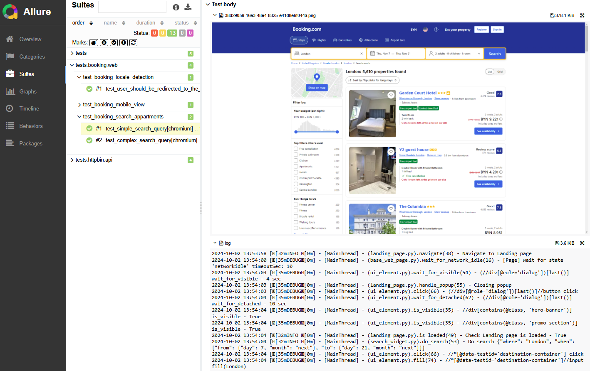
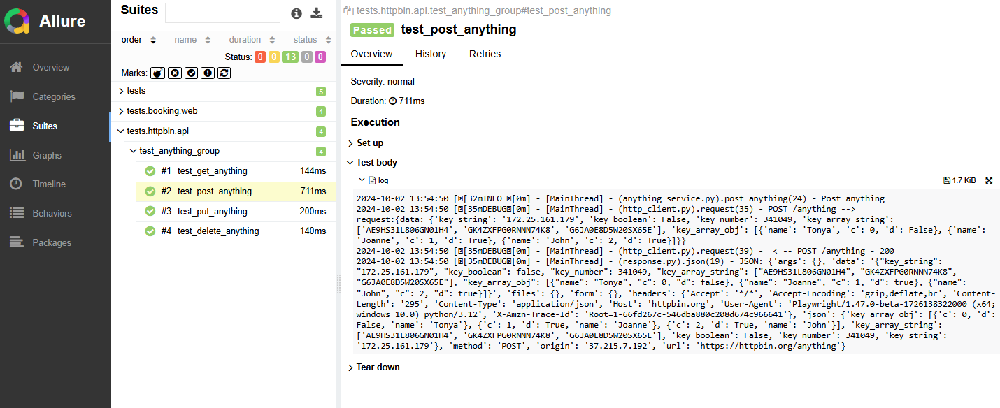

## playwright-python-starter

Test automation project boilerplate including packages structure, reporting, logging, multi-env run configuration for
WEB and API test automation.

Pure Playwright APIs wrapped a little to add more logs/traceability to test execution and to make theirs usage
less-verbose in tests.

#### Built with

| Type               | Tool/lib                                    |
|--------------------|---------------------------------------------|
| Lang               | Python (3.12+)                              |
| Build/Management   | Poetry                                      |
| Web/API Automation | Playwright                                  |
| Test Runner        | Pytest (+ playwright-pytest + pytest-xdist) |
| Logger             | Logging                                     |
| Reporting          | Allure                                      |

### Project Structure

- `src/core`  - project-agnostic code, common for any product/project to be automated
- `src/project`  - project-specific base code, including objects and utils for the particular project (pageobjects for
  web, services for api, utils, data generators, etc.)
- `tests` - project test specs, grouped by directories, components, etc. also test config definition is there (base
- `conf` - tests configuration files to be used to initialize classes/fixtures
- `output` - not a part of git repository, but all outputs collected here (reports, data captured, etc.)

### Quick Start

Install dependencies:

- `pip install poetry`
- `poetry install`
- `poetry run playwright install`
- `npm install -g allure-commandline`

Run test and vew test report:

- `poetry run pytest tests/test_health_check.py --alluredir output/allure-results`
- `allure serve output/allure-results`

#### Explore examples:

- WEB automation: `src/project/booking/`, `tests/booking/`
- API automation: `src/project/httpbin/`, `tests/httpbin/`

#### Run tests

```shell
poetry run pytest -n 4 tests/httpbin --ENV=dev --alluredir output/allure-results
```

```shell
poetry run pytest -n 2 tests/booking --project=chrome --ENV=dev --headed --alluredir output/allure-results 
```

- `-n x` to run in few threads where x - thread-count 

#### Reporting

Allure report used.
Customization added to attach text logs + screenshot per each test.

- `allure generate output/allure-results --clean --output output/allure-report` - will
  generate static report to `output/allure-report` (for CI)
- `allure serve output/allure-results` - will generate report to temp directory and will open it in browser (local).




### Configuration

#### Pytest CLI args

| arg                    | Description                                                                                                                    |
|------------------------|--------------------------------------------------------------------------------------------------------------------------------|
| `--ENV`                | ENV value for read test project-specific test configs: `[dev(default), qa, stage]`, usage `--ENV=qa`                           |
| `--project`            | project value for run tests from `conf/playwright_config.yaml`, usage `--project=firefox`                                      |
| `--headed`             | To run browser in headed mode, since headless by default, no value needed, usage: `--headed`                                   |
| `--slowmo`             | To pass launch `slowmo` value                                                                                                  |
| `--attach-screenshots` | Defines if screenshots will be attached to test report: `[on, off, only-on-failure(default)]`, usage `--attach-screenshots=on` |
| `--screenshot-mode`    | Screenshot mode: `[viewport(default), full]`                                                                                   |


#### Playwright Browser/context configuration

`conf/playwright_config.yaml` contains Playwright browser/context configs.

_Example_:

```yaml
base:
  launch_args: &base_launch_args
    #https://playwright.dev/python/docs/api/class-browsertype#browser-type-launch
    slow_mo: 100
  browser_context_args: &browser_context_args
    #https://playwright.dev/python/docs/api/class-browser#browser-new-context
    viewport:
      width: 1920
      height: 1080
    extra_http_headers: #workaround for HeadlessChrome not to be passing automatically
      user-agent: 'Mozilla/5.0 (Windows NT 10.0; Win64; x64) AppleWebKit/537.36 (KHTML, like Gecko) Chrome/129.0.0.0 Safari/537.36'

projects:
  - name: 'chrome'
    type: 'chromium'
    launch_args: &chromium_launch_args
      <<: *base_launch_args
      channel: 'chrome'
      args:
        - '--disable-dev-shm-usage'
        - '--disable-blink-features=AutomationControlled'
      ignore_default_args:
        - '--disable-component-extensions-with-background-pages'
    browser_context_args:
      <<: *browser_context_args

  - name: 'webkit'
    type: 'webkit'
    launch_args:
      <<: *base_launch_args
    browser_context_args:
      <<: *browser_context_args

  - name: 'firefox'
    type: 'firefox'
    launch_args:
      <<: *base_launch_args
    browser_context_args:
      <<: *browser_context_args

  - name: 'msedge'
    type: 'chromium'
    launch_args:
      <<: *chromium_launch_args
      channel: 'msedge'
    browser_context_args:
      <<: *browser_context_args
```

to use the browser config in tests `--project` pytest arg should be provided.

#### Multi-env configuration

In the examples `--ENV` pytest arg used to figure out the proper test configs.

Unknown or missing env value will be mapped to `dev`.

`conf/booking.ini` contains project-specific configs. e.g. base urls, etc.

_Example_:

```yaml
[ dev ]
api_base_url= https://www.api.booking-dev.com
web_base_url= https://www.booking-dev.com

[ qa ]
api_base_url= https://www.api.booking-qa.com
web_base_url= https://www.booking-qa.com

[ stage ]
api_base_url= https://www.api.booking-stage.com
web_base_url= https://www.booking-stage.com
```

_Technical details_:

```groovy
def pytest_addoption(parser):
    parser.addoption("--ENV", default="dev", help="ENV value for run tests: [dev, qa, stage]")

...

@pytest.fixture(scope="session", autouse=True)
def playwright_cli_configs(pytestconfig) -> dict[str:any]:
    return {
        'env': pytestconfig.getoption('--ENV'),
        ...
    }

...

@pytest.fixture(scope="session")
def project_configs(playwright_cli_configs) -> BookingConfigs:
    return BookingConfigs(playwright_cli_configs['env'])

...

class BookingConfigs:
    def __init__(self, env_name):
        self.env_name = env_name
        self.config = ConfigParser()
        self.config.read([..])
        ...
```

##### playwright-pytest args IGNORED
Some of [playwright-pytest args](https://playwright.dev/python/docs/test-runners#cli-arguments) 
are ignored in this project and replaced by the above provided [cli-args](#Pytest-CLI-args):

- setting next args will not take effect at all:
  ```text
  --browser
  --browser-channel
  --device
  ```

- setting next args will not cause data attached to the Allure test-report (all those traces data will be collected independently):
  ```text
  --output
  --tracing
  --video
  --screenshot
  --full-page-screenshot
  ```


### Other (Optional)

To clean up the `output` dir next can be used:

Prerequisite: `npm install rimraf`

```shell
rimraf output
```


### Other Implementations

- [playwright-typescript-starter](https://github.com/daroshchanka/playwright-typescript-starter)
- [playwright-groovy-starter](https://github.com/daroshchanka/playwright-groovy-starter)